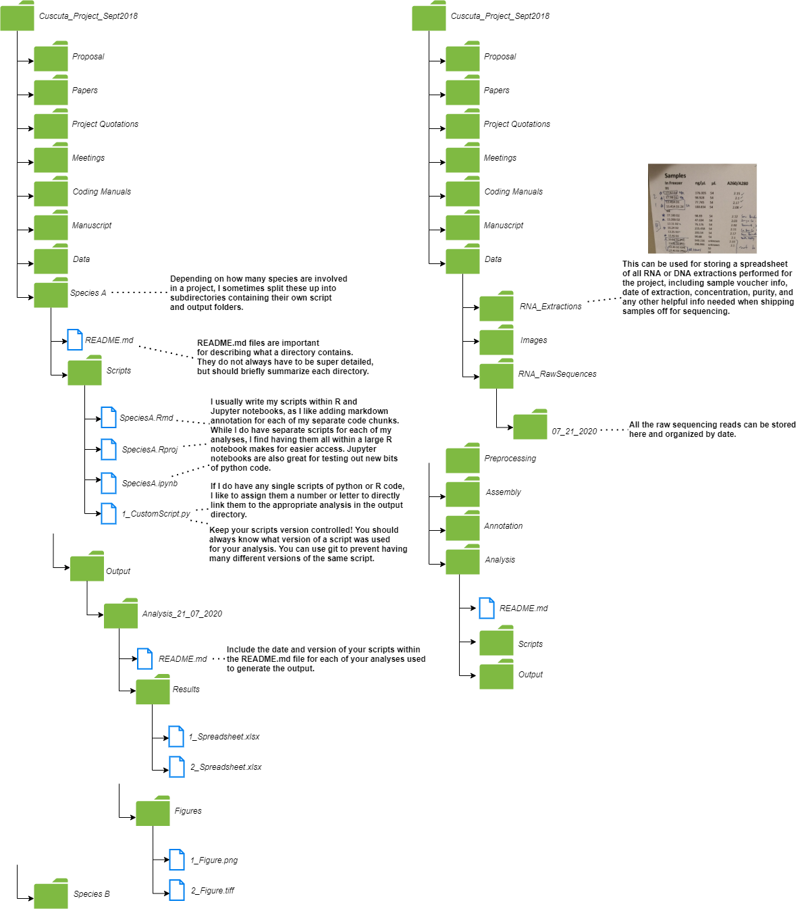

---
# Course title, summary, and position.
linktitle: Best Practices for Bioinformatics
summary: Sharing my thoughts on topics related to bioinformatics.
weight: 1

# Page metadata.
title: Data Management Best Practices for Informatics
date: "2018-09-09T00:00:00Z"
lastmod: "2018-09-09T00:00:00Z"
draft: false  # Is this a draft? true/false
toc: true  # Show table of contents? true/false
type: docs  # Do not modify.

# Add menu entry to sidebar.
# - name: Declare this menu item as a parent with ID `name`.
# - weight: Position of link in menu.
menu:
  example:
    name: Data Management
    weight: 1
---

If there’s one thing in my research that I struggled with as I began my journey into the realm of academia, it was *data management*. As a biology student, most of my prior experience with managing data involved hastily recording the amount of buffer I added into a chart from a ripped-out sheet of my lab manual, or plotting out a bacterial growth curve in Excel only for the original dataset to mysteriously vanish the day before my lab report was due. Most of my hands-on education up until grad school was heavily focused on learning procedures and interpreting results, and not so much on how to protect, store, and update the valuable data I was generating. I can’t count the number of times I used to throw my hands up in frustration over having lost or misplaced documents, or having a desktop flooded with filenames such as “dataset_v2.xlsx,” “dataset_final.xlsx,” “dataset_final_cleaned.xlsx,” or “dataset_final_edited.xlsx.” Never save important files to your desktop! On top of that, often these files would be hidden across multiple directories labeled “JUNK,” or “SCHOOL STUFF,” and sometimes leading to subdirectories with even more confusing and ambiguous filenames. I realized that there had to be a better way to manage my projects, especially when I was suddenly thrown into a role dealing with terabytes of sensitive and costly data. Good data management quickly became a priority within my research methods, and further, it allowed me to ensure my research is reliable and reproducible in the future.

Here, I’d like to share some of the best practices that I’ve learned for data management. Most of these come directly from my own experiences, and often failures, as well as from the helpful input of other researchers I’ve talked to. While there’s no directly standardized practice of managing data, I feel that I’ve come up with a reliable system that works for me as a researcher and aspiring bioinformatician. There are many different systems out there, but I feel these practices help me to stay organized and keep the focus on conducting good research.

## 1.	The Importance of Reproducible Research

Reproducible research should be a crucial component of any project or research undertaking. Any individual should be able to download my data, repeat my analyses, and still end up with the same results. This helps to ensure research credibility, strengthens the importance of our gathered evidence, extends the reach of our findings to other collaborators who may be interested in continuing or designing a related project, and allows for the ease of reusing existing scripts or project protocols.
One way we can ensure that our project is reproducible is by focusing on data management and organization from the get-go. Before even beginning our research, we can come up with a list of general questions to help us consider the types of data and data collection methods we might be dealing with, the different analyses we might need to perform, and the types of output files we might end up with. For example:
1.	How much raw data will we need to collect?
2.	Will all our raw data be accessible at once or collected over a period of time?
3.	How is our raw data structured and stored?
4.	How will we process our raw data (i.e. does it need to be cleaned, trimmed, manipulated, combined with other datasets, etc.)?
5.	What common analyses may we need to perform on our data?
6.	What are our desired outcomes for this project (i.e. are we looking to generate a specific data visualization, record the results from a specific analysis, add to our existing findings or interpret entirely new evidence, etc.)?

Developing a simple schematic for the project can help you in maintaining a structured and well-organized research management system. While many of your initial answers to these questions may change throughout the course of the research, understanding a project’s fundamental design can help you and fellow researchers ensure the results remain reproducible, and aid you in achieving your original project goals.

<figure>
        
</figure>

  
  

Here are some figures from my initial committee meetings in grad school. In the first figure, I outlined the major chapters of my thesis, distinguished here as “projects” (which would later be revised and saved for future chapters due to time constraints). In the second, I devised a basic flowchart outlining each stage of my project, and the potential software/tools I would use to conduct my desired analyses. Of course, many of these tools were replaced or removed in the final project, but having this handy flowchart available helped me consider how data had to be managed at each research stage.

## 2. Managing Data using Directories

Creating a proper directory system is one of the core organizational tools I use in making sure my data is easily accessible and contains all the necessary project information I need. I begin by creating a new main directory for the entire project. Each individual project should get its own directory following a personalized system of file naming conventions. This naming system should be descriptive, easy to remember, and allow files to be identified even after long periods of inactivity. For example, I might name a major directory “Cuscuta_Project_Sept2018.” All files relevant to the project will go in here, and I’ve also included the start date of the project. Within this major directory, I tend to break down the project into subdirectories representing each major research stage. For this project, that would be represented by “Preprocessing,” “Assembly,” “Annotation,” and “Analysis.” While the directory structure within each major stage might need to be flexible, the overall directory structure will be mirrored across all major directories. This flexibility might be due to differences in the types of project files that require storage, the size of these files, the way they were generated, or how they need to be processed.

Within my main project directory, I also like to include the following subdirectories:
*	Proposal: This contains my project proposal and other similar proposals within my laboratory research group. I found this helpful to flip back to when writing my manuscript, as it outlined some of the initial project goals I had and included a good summary of why I began my research.
*	Papers: I keep any important or relevant research publications in here for easy referral.
*	Project Quotations: This contains summaries of my project quote when I sent my initial data for Illumina sequencing, including the types of services I requested and purchased, all correspondence I had with the company, and all submission forms and confirmation summaries related to data sequencing.
*	Meetings: This contains all files necessary for my regular committee and supervisory meetings. I store any report summaries (including drafts and final versions), powerpoint slides, report feedback, and any other relevant files organized by date and meeting type.
*	Coding Manuals: This contains any manuals that I can use for quick referral when coding, such as The Linux Command Line, Python for Biologists, RNA-seq workshop manuals, cheatsheets for R, and other helpful guides.
*	Manuscript: This contains all my drafts, outlines, and notes for my project manuscript. I also store files related to data collection, voucher information, RNA extraction measurements, and other helpful tips and guidelines for proper manuscript writing.
*	Data: This contains all of my raw project data. This includes my sequencing data reads, excel spreadsheets, and photo images. Due to the sheer size of some of my sequencing files, I sometimes omit them from this folder and store it elsewhere.
*	Scripts: This is where I store my custom scripts for the project. This can include Python scripts for cleaning my data, R and Jupyter notebooks containing scripts for data analysis/visualization, Bash scripts for file renaming, and so on. 

Within my R and Jupyter notebooks, I split each of my analyses up into sections, each with their own separate annotated code chunk and explanation of the analysis written in markdown. This explanation includes the purpose for performing the analysis, what datasets it requires for input, and sometimes how the code can be modified to produce different output versions (e.g., generating a black/white vs. coloured figure in the final output based on journal recommendations).
*	Output: This contains all results and figures generated from my scripts and analyses. These files are typically named in correspondence to the script used to generate them, such as “1_CorrelationPlot_Rnotebook.pdf” or “1_BLASTp_1e-3_output.tab.” It is also often helpful to create a “Preliminary Output” directory when attempting to generate new output. This way you can test out a new script or create a multitude of temporary files that won’t immediately get lost with the rest of your final output results. Once you have the correct output you need, you can then transfer only the necessary files to the main output directory and label them appropriately.

## 3. Creating README.md Files

If you’ve ever created a project directory years ago on an old hard drive, perhaps with an aforementioned ambiguous file structure, and are stuck wracking your brains to make sense of what “file1_v4.xlsx” and “test_python_script_final_edit_1.py” are all about, you’ll realize the importance of what a simple README.md file can do for helping you keep track of long term research endeavors.

Most, if not all directories in your project should have its own dedicated README.md file to keep track of the contents in the directory. This is especially important for all data, script, and output directories, as they often contain the files you’ll be working and versioning with most often. The README.md file does not have to be overly complicated;  it could be as simple as a single line describing the directory, or a detailed summary of each file and script contained within a folder, including information about dependencies, script functionality, and additional notes to yourself about the script’s purpose and typical usage.

When creating a README.md file, there are a number of questions you could consider:
*	For a data directory: What type of data is stored? How was the data generated? What is the format(s) of the data? Important dates involving data sequencing or collection information? What naming conventions does the data follow?
*	For a scripts directory: Include a summary of each script, including functions, dependencies, and typical usage. Also include version information if multiple similar scripts exist.
*	For an output directory: What type of analysis was performed? When was it performed? What script and script version did you use to perform the analysis? For certain analyses, did you assign specific parameters or statistical cut-offs to run the analysis? What naming conventions does the output data follow?
 
Here’s a simple README.md file that might be used for my data and scripts folders. This is written in Markdown using VCS.

## 4. Naming Conventions

While naming files comes down to personal preference, there are a few general conventions that are important to keep in mind when developing your own system for data management. Always use an underscore (\_) in place of a space, which will otherwise cause headaches when trying to locate or open any file via the command line. Additionally, try to use easy to remember patterns in your naming system. This can be especially important if you are trying to automate tasks using regex at a later point.

When I am naming samples, I make sure to assign each sample a unique identifier. While this identifier may differ depending on the project, the system I use is to include the voucher identifier, followed by the population’s ploidy level, and finally the species identifier. For example:
*	For the voucher population labeled as 13-25 and a ploidy of 2N (diploid) for species A, I would assign it the name “13-25_2N_A”
*	For the voucher population labeled as 17-98 and a ploidy of 4N (tetraploid) for species A, I would assign it the name “17-98_2N_A”
*	For the voucher population labeled as 13-29A and a ploidy of 2N (diploid) for species B, I would assign it the name “13-29A_2N_B”

As my thesis project involved dealing with multiple unique plant species and populations of differing ploidy level, I felt it was important enough to include within all of my file naming conventions so that I did not accidently run an analysis using a diploid population when I meant to use a tetraploid. However, this convention was of specific importance to my project, and it may not be necessary to include such info into yours.

Another way you can name files is by assigning your samples a three-letter code followed by a number, and if necessary, the species identifier. For example, for my Cuscuta project, I could also name samples using the convention CUS_001_A. These identifiers could be kept in a spreadsheet containing additional voucher and ploidy information.
For files, ensure that the name of the file is descriptive enough that you know exactly what it represents. For example, if I had an R script that generated a bivariate correlation matrix, I could name the file “CorrelationMatrix.R.” However, owing to the fact that scripts tend to produce output, and that I may be using multiple versions of the same script to produce some result, it is helpful to add an additional identifier to the script name, such as “1_CorrelationMatrix.R.” This helps to link the correct script to the correct analysis output, “1_CorrelationMatrix.pdf”

## 5. Version Control

Version control essentially means keeping track of any changes and edits made to files and documents. If I am writing a script to run a specific analysis, I may decide at a later point to go back and re-run the analysis after modifying the code slightly. We re-run the analysis with the appropriate changes, and… yikes! We now have a completely different output and result than our initial run! Looks like we might have broken our code.

Luckily, software such as Git can help us solve our problem. Using Git, we can save multiple versions of a document, identify the exact differences between those document versions, and even revert back to previous versions if our code is now truly a mess beyond saving. There are entire tutorials dedicated to using Git efficiently for data management, and I will discuss the basic procedures I’ve used within my own project in a later post.

## 6. Storing your Data

Now that we’ve spent all that time designing a project schematic, organizing our data into directories, creating README.md files, coming up with naming conventions, and learning version control… we want to be absolutely certain that we store all of that sensitive information in a safe and protected place! While long term storage plans for data can be reliant on how long you have access to the data, how sensitive and private the data is, and any other ethics concerning where it can be stored, here are some general tips to consider when backing up your project.
You can store your data in a multitude of locations, including:
*	Your personal desktop or laptop
*	Your laboratory desktop
*	An external hard drive
*	Personal cloud storage such as Google Drive, Dropbox, OneDrive, pCloud, or other in-house laboratory options.
*	Flash Drives (typically better for temporary data storage)
*	HPC servers designed for long term data storage

I highly recommend storing your data in three separate locations. When storing your data, also use two separate types of long term storage methods. Sometimes cloud networks fail, other times hard drives can get lost, or computers can break down. It’s best to have a number of other solutions to rely on. Also, make sure at least ONE of the methods you choose is outside of your personal storage options, such as a school cloud network or lab computer.
